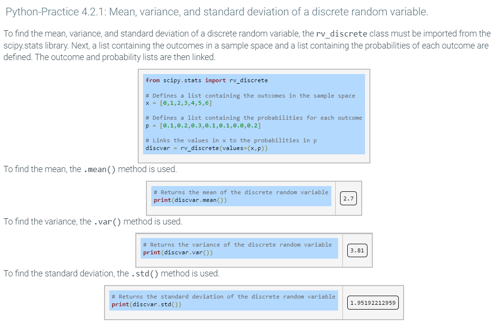

# Notes

> Notes containing major notes that I need to take.

## Week 1

### 1.1

- A **quantitative variable** can take on a numeric value (quantitative data) that can be measured and ordered. Ex: A person's age, the outside temperature, and a meal's price are quantitative variables. Example numeric values are an age of or years, a temperature of or degrees, and a price of or dollars.

- A **categorical variable** can take on the value (usually a label) of one of several categories. Ex: A person's gender, seasons, and U.S. companies are categorical variables. Gender can be male or female, seasons can be fall, winter, spring, or summer, and U.S. companies can be Wal-Mart, McDonalds, UPS, etc. A categorical variable is often called a qualitative variable (known by qualities, rather than quantities).

- A **nominal variable**'s categories have no ordering, existing in name only, like apples, oranges, and grapes. ("Nominal" means "in name only").

- An **ordinal variable**'s categories have an ordering, like disagree, neutral, and agree.

- A **continuous variable**'s values are infinite along a continuum of values within a range, typically real numbers. Continuous variables usually represent measurements, like height ( meters) or temperature ( degrees).

- A **discrete variable**'s values are finite within a range, typically integers. Discrete variables usually represent countable items, like people in a family () or cars in a city (). Generally, if "number of" can be added to the beginning, the variable is discrete, like "number of people in a family", but not "number of height". Note: "Discrete" means separate or distinct, not to be confused with "discreet" which means careful or unobtrusive.

### Pandas - DataFrame

#### Attributes

| DataFrame.attribute | Description of output                                  |
| :------------------ | :----------------------------------------------------- |
| axes                | Index and column labels                                |
| columns             | Column labels                                          |
| dtypes              | Data types of values in each column                    |
| index               | Index labels                                           |
| shape               | Ordered pair that gives the number of rows and columns |
| size                | Number of values in the DataFrame                      |
| values              | Values in the DataFrame                                |

#### Methods

| DataFrame.method | Description of output                              |
| :--------------- | :------------------------------------------------- |
| describe()       | Summary statistics for numerical columns           |
| head(), tail()   | First/last rows in the DataFrame                   |
| min(), max()     | Minimum/maximum of values in a numerical column    |
| mean(), median() | Mean/median of values in a numerical column        |
| sample()         | Random row                                         |
| std()            | Standard deviation of values in a numerical column |

### Percentile


### Research

- Normal distribution
- Central limit theorem

### Survey Sampling

- Descriptive statistics focuses on summarizing survey data about a sample drawn from a population. Summary statistics include measures of central tendency such as mean, median, and mode; and dispersion such as range and standard deviation. Descriptive statistics cannot make conclusions based on the data. Rather, descriptive statistics is a way to present data in a meaningful way.

- Inferential statistics focuses on using information from the sample to make conclusions about the population from which the sample was drawn. The two primary methods of inferential statistics are confidence intervals, which specify the range within which a parameter falls with a given probability, and hypothesis testing, which allows differences between population parameters to be compared.

- Surveys are conducted to allow statisticians to make generalizations about a population.

- A population is any collection of objects, people, or things about which statistical inference are made. A parameter of a population is a numerical characteristic of a population, such as mean, median, or standard deviation.

- A sampling unit is an individual in the population on which a measurement can be taken.

- The sampling frame is the subset of the population from which a sample is drawn.

- The sample is composed of the sampling units that provide data to be collected.

- A statistic is a numerical characteristic of a sample, rather than the population.

### Bias

In statistics, a bias is a difference between the parameter predicted from a survey from the true value of the parameter in the population. Two broad categories of statistical bias include selection bias and response bias.

Selection bias exists when the sampling units selected from a population are not representative of the entire population, and are instead biased toward certain subsets of the population. A population should be surveyed in such a way to minimize sampling bias. Several types of selection bias follow.

Undercoverage occurs when certain members of a population are inadequately represented in a sample.

Nonresponse bias occurs when a sample is biased toward members of a population that participate in a survey.

Voluntary response bias occurs when a sample is biased toward members that self-select for participation in a survey.

Response bias can result if the responses of survey participants are affected by how a question is asked or the behaviors or attitudes of the participant. Several types of response bias follow.

Acquiescence bias occurs when respondents tend to agree with a statement in a survey.

Extreme responding occurs when respondents tend to select the most extreme options available.

Social desirability bias occurs when respondents tend to answer questions in a way that is socially accepted by others. In other words, a social desirability bias exists when respondents over-report "good" behaviors or under-report "bad" behaviors.

### Sampling Methods

Sampling methods
Different sampling methods can help mitigate certain types of statistical bias.

In simple random sampling, a sample is constructed by random selection from the population. Mathematically, simple random sampling is a sampling method in which all possible samples consisting of n units selected from a population of N units are equally likely.

In systematic sampling, every Kth (1st, 10th) unit from a population of units is selected to be in a sample.

In stratified sampling, the population is first divided into groups, or strata, depending on some characteristic. Next, samples within each stratum are randomly selected in a proportional manner.

In cluster sampling, the population is first divided into groups, or clusters, depending on some characteristic. Next, the sample is constructed by randomly selecting one or more clusters.

In convenience sampling, units are drawn from a subset of the population that is readily available.

### Mode

The mode is the most frequently-occurring value in a dataset and is another measure of center. A dataset may have multiple modes if multiple values have the same maximum frequency. A dataset with only unique values does not have a mode.

### probability Mass Function


The probability mass function must add up to 1 otherwise it cannot be considered a pmf

### The cumulative distribution function of a probability distribution


Done by added up all the probabilities of f(x) then doing the next set of operations.

### Mean or expected value of a discrete random variable


example:


python:



```python
from scipy.stats import rv_discrete

# Defines a list containing the outcomes in the sample space
x = [0,1,2,3,4,5,6]

# Defines a list containing the probabilities for each outcome
p = [0.1,0.2,0.3,0.1,0.1,0.0,0.2]

# Links the values in x to the probabilities in p
discvar = rv_discrete(values=(x,p))

# Returns the mean of the discrete random variable
print(discvar.mean())

# Returns the variance of the discrete random variable
print(discvar.var())

# Returns the standard deviation of the discrete random variable
print(discvar.std())
```
